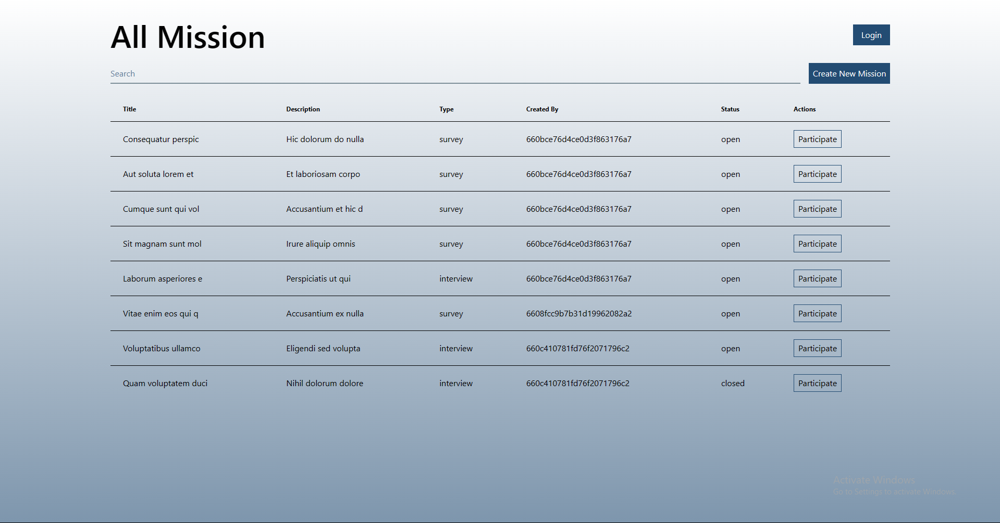

# User Engagement Platform

This a platform where user can participate in surveys and interviews. Also then can create any mission(Survey/Interview) as they like

## For making this application I used:
- React JS
- Tailwind JS
- Daisy UI
- React Router DOM

## User Credential
- username: pujondass
- password: pujondas

## <a href="https://user-engagement-platform-frontend-4798pj2bw-the-pujon.vercel.app/"> Click here for demo </a>